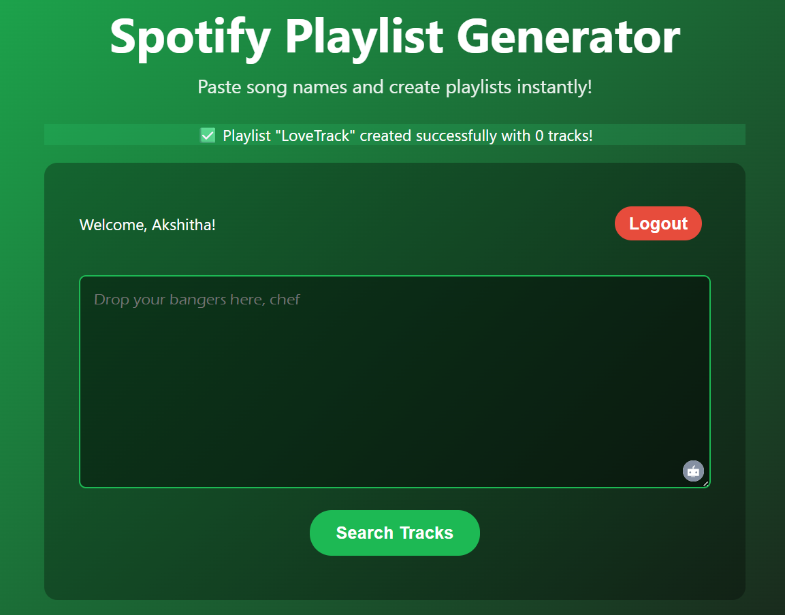

# 🎵 Spotify Playlist Generator

A full-stack web application that lets you create Spotify playlists by simply pasting song names. The app automatically searches for tracks and creates playlists directly in your Spotify account.

##  Features

- **Spotify Authentication**: Secure OAuth login with your Spotify account
- **Bulk Track Search**: Paste multiple song names and find matching tracks
- **Automatic Playlist Creation**: Creates playlists directly in your Spotify account
- **Real-time Results**: See which songs were found and which weren't
- **Responsive Design**: Works on desktop and mobile devices

## 📸 Screenshots

### Main Application Interface

*The main interface showing the song input area and playlist creation functionality*

### Application Dashboard

*User dashboard after successful Spotify authentication*

### Playlist Creation Success

*Successful playlist creation with track search results*

## 🛠️ Tech Stack

##  Tech Stack

- **Frontend**: React.js with modern hooks and styling
- **Backend**: Node.js with Express.js
- **Spotify API**: Official Spotify Web API integration
- **Authentication**: OAuth 2.0 with Spotify

##  Prerequisites

Before running this application, you need:

1. **Spotify Developer Account**: Create an app at [Spotify for Developers](https://developer.spotify.com/)
2. **Node.js**: Version 14 or higher
3. **npm**: Comes with Node.js

##  Setup Instructions

### 1. Clone and Install Dependencies

```bash
# Install root dependencies
npm install

# Install server dependencies
cd server
npm install

# Install client dependencies
cd ../client
npm install
cd ..
```

### 2. Configure Spotify API

1. Go to [Spotify for Developers](https://developer.spotify.com/dashboard/)
2. Create a new app
3. Note down your **Client ID** and **Client Secret**
4. Add `http://localhost:3000/callback` to your app's Redirect URIs

### 3. Environment Setup

Create a `.env` file in the `server` directory:

```env
SPOTIFY_CLIENT_ID=your_spotify_client_id_here
SPOTIFY_CLIENT_SECRET=your_spotify_client_secret_here
SPOTIFY_REDIRECT_URI=http://localhost:3000/callback
PORT=5000
```

### 4. Run the Application

```bash
# Start both frontend and backend
npm run dev

# Or start them separately:
# Backend (from server directory): npm run dev
# Frontend (from client directory): npm start
```

The app will be available at:

- Frontend: http://localhost:3000
- Backend: http://localhost:5000

##  How to Use

1. **Login**: Click "Login with Spotify" and authorize the app
2. **Add Songs**: Paste song names in the textarea (one per line)
   ```
   Bohemian Rhapsody - Queen
   Imagine - John Lennon
   Billie Jean - Michael Jackson
   ```
3. **Search**: Click "Search Tracks" to find matching songs
4. **Create**: Enter a playlist name and click "Create Playlist"
5. **Enjoy**: Your playlist will appear in your Spotify account!

## Project Structure

```
spotify-playlist-generator/
├── client/                 # React frontend
│   ├── public/
│   ├── src/
│   │   ├── App.js         # Main React component
│   │   ├── App.css        # Styling
│   │   └── ...
│   └── package.json
├── server/                 # Node.js backend
│   ├── index.js           # Express server
│   ├── package.json
│   └── .env.example
├── package.json           # Root package.json
└── README.md
```

##  API Endpoints

- `GET /auth/login` - Get Spotify authorization URL
- `POST /auth/callback` - Handle Spotify callback and get tokens
- `POST /search` - Search for tracks by name
- `POST /create-playlist` - Create playlist with found tracks
- `GET /health` - Health check endpoint

##  Customization

- Modify `client/src/App.css` for styling changes
- Adjust search logic in `server/index.js`
- Add more Spotify API features (public/private playlists, descriptions, etc.)

##  Security Notes

- Never commit your `.env` file or Spotify credentials
- The app requests minimal Spotify permissions (playlist creation only)
- Access tokens are stored temporarily in localStorage

##  Troubleshooting

**"Failed to authenticate"**: Check your Spotify app credentials and redirect URI

**"No tracks found"**: Try more specific song names with artist names

**Server won't start**: Make sure port 5000 is available or change PORT in .env

##  License

MIT License - feel free to use this project for learning or personal use!

---

**Built with ❤️ for music lovers who want to create playlists faster!**
